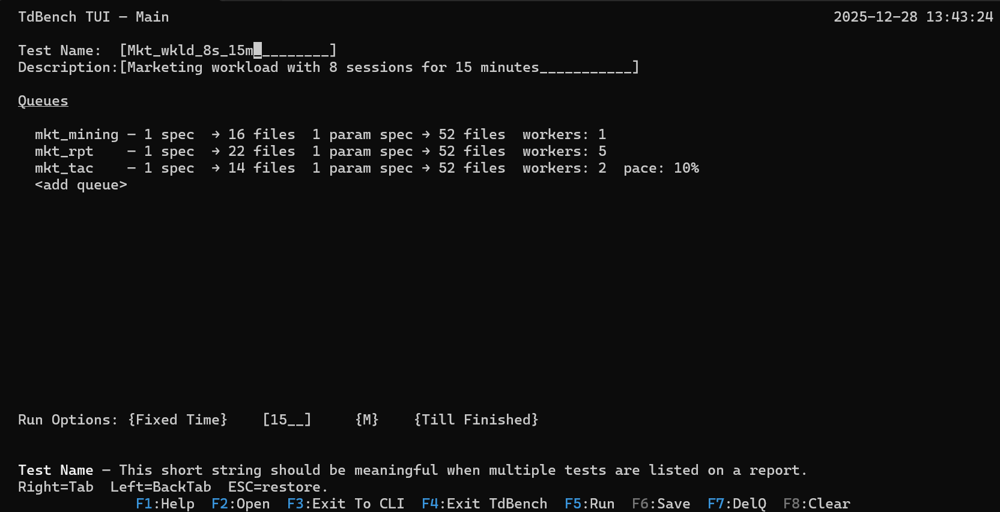
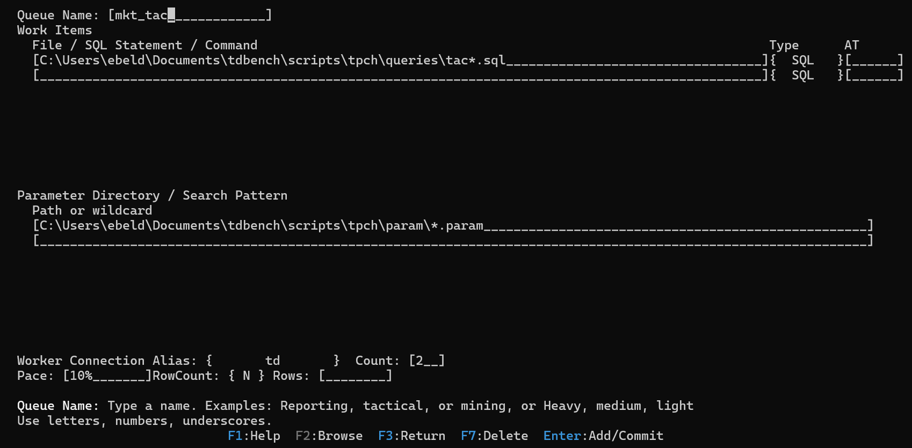

<p align="center">
  
</p>

<p align="center">
  <a href="#download">Download</a> •
  <a href="#quick-start">Quick Start</a> •
  <a href="#tui-screens">TUI Screens</a> •
  <a href="#supported-dbms-drivers">DBMS Drivers</a> •
  <a href="#documentation">Documentation</a>
</p>

---

## What is TrueBench?

**TrueBench (QueryDriver)** is an interactive and script-driven workload generator designed to
help DBAs, performance engineers, and application teams simulate **realistic** database and
system behavior.

TrueBench makes it practical to model realistic workloads, replay tests, and track results so
you can:

- validate DBMS configuration changes against production-like workload behavior
- create anticipated workloads for new applications before deployment
- provide engineers with repeatable performance tests for tuning and regression analysis
- stress test environments and simulate adverse events (latency spikes, concurrency surges,
  resource contention)
- measure variability and isolate non-DBMS effects (network jitter, client-side overhead)

TrueBench features:

- a powerful **CLI** for script-driven execution of repeatable tests with variables, IF, GOTO, etc.
- a full-screen **TUI** (Text User Interface) for defining and editing workloads
- a portable **Python virtual environment** automatically created on first startup
- support for 14 DBMS drivers (native Python and ODBC)
- integrated metadata tracking (SQLite) for run history, results, and comparisons
- ability to coordinate analysis of query log data on the host DBMS

TrueBench can execute single diagnostic queries, orchestrate multi-queue benchmark workloads,
or automate complex test suites that closely reflect real production behavior.

Installation instructions and driver setup are in **INSTALL.md**.

---

<a id="download"></a>
# Download

The TrueBench python code, help files, and DBMS setup templates is provided in a zip file. 

1) Go to the GitHub **Releases** page (right panel of this repo)
2) Download the latest ZIP release (example name: `truebench_01_00.zip`)
3) Unzip it into a working directory, for example:
   - Windows: `C:\truebench\`
   - Linux/macOS: `~/truebench/`

The ZIP includes:
- `truebench.bat` and `truebench.sh` launchers
- `truebench_01_00/` code directory and help files
- `setup/` vendor DBMS integration scripts and notes
- `INSTALL.md`, `README.md`, and documentation

---

<a id="quick-start"></a>
# Quick Start (4 statements once connected)

Connect to your DBMS using the DB command, which defines a reusable connection alias.

```
DB td teradata url=myserver user=myuser password=?
```

That is done once per TrueBench session so you can put it in the truebench.tdb startup file. 

Optional: You can validate connectivity to your DBMS and measure latency with:

```
validate td
```

Then **it only takes 4 statements** to define a test with 4 threads (workers) running for 5 minutes. 

```
DEFINE MyFirstTest
QUEUE q1 SQL queries/*.sql
WORKER q1 td 4
RUN 5m
```

But a slightly more interesting production workload isn't much more complicated. 

```
DEFINE Wkld01 Test call center + sales with data load at 5 minutes

QUEUE callctr SQL queries/cc*.sql
PARAM callctr params/cc*.param
PACE callctr .5s
WORKER callctr 2

QUEUE sales SQL queries/sales*.sql
PARAM sales params/sales*.param
WORKER sales td 4

QUEUE etl at 5m OS scripts/load_daily.sh
WORKER etl OS
RUN 15m
```

---

<a id="tui-screens"></a>
# TUI Screens (Test Editor)

TrueBench includes a full-screen **TUI (Text User Interface)** editor for defining and running
workloads interactively. Think of it as a keyboard-driven GUI that runs inside your terminal.

<p align="center">
  
</p>

TrueBench uses a separate editor form for each queue, allowing you to define queue contents,
worker counts, pacing, and parameter file patterns.

<p align="center">
  
</p>

The TUI supports both interactive and automated workflows:

- Run immediately from the main form (for tuning and validation during development)
- Save the workload definition as a `.tdb` script for later execution
- Use saved scripts as part of a repeatable benchmark suite executed from the CLI

From the CLI prompt, start the TUI using:

```
SCREEN
```

---

# Directory Layout (after unzip)

Typical structure:

```
truebench/
   truebench.bat
   truebench.sh
   truebench.tdb
   README.md
   INSTALL.md
   setup/...             (one directory for each known DMBS)
   truebench_nn_nn/      (current release, e.g. truebench_01_00))
   .venv/                (virtual environment created on first run)
   metadata/
   logs/
   temp/
```

Note:
- The `.venv` directory is created automatically when you run TrueBench the first time.
- `.venv` is OS-specific (Windows venv cannot be reused on Linux/macOS).

---

# Starting TrueBench

## Windows
Run:

```
truebench.bat
```

## Linux / macOS / WSL
Run:

```
./truebench.sh
```

On first launch, TrueBench automatically:
- creates a Python virtual environment under **`.venv/`**
- installs required Python dependencies
- prompts when optional DBMS drivers (for example, `pyodbc`) are needed

You do **not** need to install Python packages manually unless you want direct access to the virtual environment.

---

# Running in Batch Mode (non-interactive)

## Windows
```
truebench.bat  myscript.tdb
```

## Linux / macOS
```
./truebench.sh  myscript.tdb
```

You may also pass a list of scripts to run:
```
./truebench.sh  serial.tdb  wkld01.tdb  wkld02.tdb
```

Batch mode uses the same parser and engine as interactive mode, ensuring consistent behavior across development, validation, and automation workflows.

---

# The `truebench.tdb` Startup File

On startup, TrueBench looks for a file named:

```
truebench.tdb
```

in the TrueBench root directory.

This file is typically used to define:
- database aliases (`DB`)
- shared variables (`SET`)
- hooks (`BEFORE_RUN`, `AFTER_RUN`, `AFTER_NOTE`)

Example:

```
DB td teradata url=myserver user=demo password=?
SET env=dev
```

---

# Getting Help Inside TrueBench

Use a command followed by `?` for basic syntax:
```
DB ?
RUN ?
QUEUE ?
```

Help topics:
```
HELP
HELP <topic>
HELP _all_commands
HELP _all_topics
```

Full-screen help uses the TUI help viewer supporting browsing files and clickable links:
```
MAN <topic>
```

---

<a id="supported-dbms-drivers"></a>
# Supported DBMS Drivers

TrueBench supports:

- Native Python DBMS drivers (preferred when available)
- ODBC connectivity using `pyodbc`
- Generic ODBC option (Excel, Access, CSV/text sources, and many DBMS via ODBC)
- Generic Python DB-API driver (`pydbapi`) for advanced users with non-built-in drivers

To see available drivers:
```
LIST DRIVERS
LIST ODBC
```

Driver setup and guidance is documented in:
- `INSTALL.md`
- `HELP drivers` / `MAN drivers`
- `setup/<dbms>/README.md`

---

# Metadata Tracking

TrueBench records all test metadata in an embedded SQLite database, including:

- test definitions
- per-query execution details
- run statistics
- row counts and timings

The special alias `me` routes SQL to the SQLite metadata database:

```
SELECT * FROM testtracking;
SELECT * FROM testresults WHERE runid = :runid;
```

This model supports repeatability, comparisons across runs, and correlation to DBMS query logs.

---

<a id="documentation"></a>
# Documentation

- **INSTALL.md** — installation + driver setup
- **ABOUT.md** — design philosophy / methodology
- **CONTRIBUTE.md** — contributions and improvements
- `setup/` — vendor-specific scripts and DBMS integration notes
- Help system inside TrueBench:
  - CLI: `HELP`, `MAN`
  - TUI: F1

---

# Contributing

Contributions are welcome, especially:
- DBMS setup scripts and views under `setup/<vendor>/`
- additional DBMS driver integrations
- documentation improvements and examples

See **CONTRIBUTE.md**.

---

# License

TrueBench is delivered as-is without warranty.  
Copyright © 2026.
